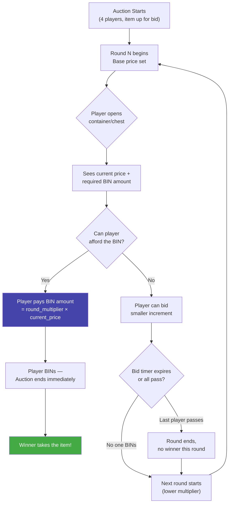

# CLAUDE.md

This file provides guidance to Claude Code (claude.ai/code) when working with code in this repository.

## Project Overview

**MagicAuction** is a PaperMC plugin (1.21+) that implements a container-bidding auction minigame inspired by games where players bid on mystery boxes/items across escalating rounds.

## Build & Development Commands

```bash
# Build all modules (produces shaded plugin JAR in core-plugin/build/libs/)
./gradlew clean build

# Build only the API module (for publishing)
./gradlew :core-api:build

# Build only the plugin shaded JAR (skip API module build)
./gradlew :core-plugin:shadowJar

# Publish API to Yuemi Maven
./gradlew :core-api:publish

# Generate Javadocs
./gradlew :core-api:javadoc

# Test compilation (no full build)
./gradlew clean compileJava compileTestJava
```

The output JAR is at `core-plugin/build/libs/MagicAuction-<version>.jar` — deployable directly to a PaperMC server's `plugins/` directory.

## Game Design — Auction Rounds

The core mechanic is a **container bidding game** with these rules:



**Default round multipliers (configurable):**

| Round | Overbid Multiplier | Vibe |
|-------|-------------------|------|
| 1     | 2.0× | "You *really* want it?" |
| 2     | 1.5× | Getting warmer |
| 3     | 1.3× | Tempting... |
| 4     | 1.1× | Sneaky territory |
| 5     | 1.0× | At cost — BIN or lose it |

- **Players:** 4 per auction session (each opens their own container/chest to bid)
- **Rounds:** 5 rounds per game (configurable count + custom multipliers per round)
- **BIN mechanic:** Each round has an overbid multiplier — to win instantly ("BIN"), a player must outbid the current price by at least that multiplier. The first player to BIN wins the auction — no going once, twice, gone.
- **Winner:** The player who successfully BINs on a round takes the auction item
- The rising tension: early rounds require a huge overbid, late rounds let players snipe at near-market price. If nobody BINs through all 5 rounds, the auction ends with no winner.

All round counts and multipliers should be configurable via `config.yml` so server admins can customize the pacing.

### Plugin Lifecycle

- **onEnable:** Initializes config, copies default resources for `auction/` and `items/`, starts `AuctionManager`, registers commands via `CommandRegistry`, and exposes `MagicAuctionApi` service.
- **onDisable:** Unregisters the API service.

### Config & Item Resolution

- **3x6 Grid Packing**: Inside the 6x9 chest preview GUI, items are packed in a 3x6 container offset (starts Row 1, Column 1) starting from the top-left available position. Items specify width and height and cannot overlap or exceed boundaries.
- **Seed System**: When starting an auction, an optional seed can be passed. If it is `<= 0` (including `-1` or other negative values) or omitted, a random positive seed is generated. Shuffling and packing of prizes is governed by a `java.util.Random` initialized with this seed to guarantee deterministic layout reproduction.
- **Base Item Resolution & Overrides**: Every custom item config defined under `items/` must specify a `base-item` resolved dynamically via YueMiLibs. Name, lore, and custom model data overrides are conditionally applied to the base item stack.
- **Prizes & Rewards Resolution**: Arena rewards and container items are resolved strictly from the local `items/` directory configuration first.
  - If a custom item is virtual, the winner receives its `worth` directly in their economy balance.
  - If a custom item is non-virtual, its `rewards` section is mandatory, containing either commands (e.g. `type: "command"`, `value: "..."`) or YueMiLibs item keys (e.g. `type: "item"`, `id: "..."`). Non-virtual custom items are never physically awarded directly; only their nested `rewards` are distributed on win.
- **Bot Players (`module-bot`)**: A separate subproject library shaded into the core plugin. Using `_BOT_` in arguments resolves to dynamic sequential bot players (`Bot 1`, `Bot 2`...). Bidding is simulated after a 1-3s delay with random realistic decisions, and inventory/economy operations are protected against bot winners.

## Key Conventions

- **Package:** `org.yuemi.magicauction.(api|plugin).*`
- **Commands Packaging:** Root commands in `commands/`, subcommands in `commands/subcommands/` (one file per subcommand), registered via `CommandRegistry`.
- **YueMiLibs Integration:** Uses `YueMiLibsProvider.getApi()` to resolve economy, items, and layered GUI builders.
- **Messages:** Uses Adventure MiniMessage for rich text formatting.
- **Java 21, Gradle 8.13, Kotlin DSL**

## CI/CD

- **Build workflow** (`.github/workflows/build.yml`): On push to `main` / PR — `./gradlew clean build`, uploads JAR as artifact.
- **Publish workflow** (`.github/workflows/publish.yml`): On `v*` branch push — compiles, auto-updates contributors & version in `gradle.properties`, publishes API to Yuemi Maven, builds plugin JAR, generates Javadocs, deploys to GitHub Pages, publishes to Modrinth, and creates a GitHub Release with changelog.
