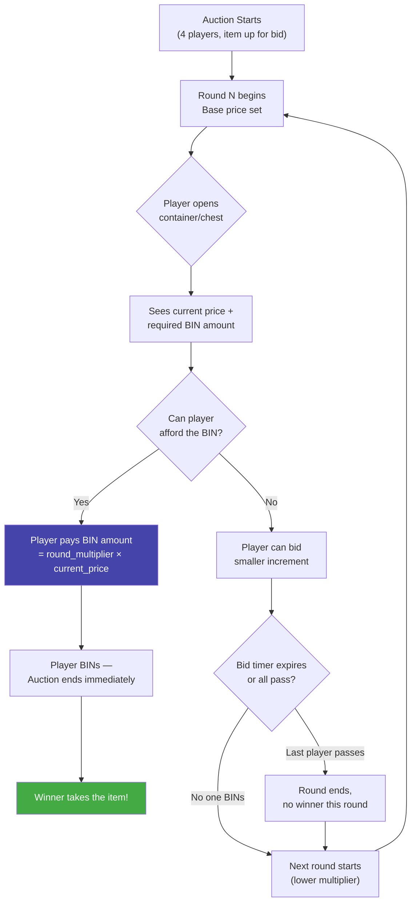

# CLAUDE.md

This file provides guidance to Claude Code (claude.ai/code) when working with code in this repository.

## Project Overview

**MagicAuction** is a PaperMC plugin (1.21+) that implements a container-bidding auction minigame inspired by games where players bid on mystery boxes/items across escalating rounds.

## Build & Development Commands

```bash
# Build all modules (produces shaded plugin JAR in core-plugin/build/libs/)
./gradlew clean build

# Build only the API module (for publishing)
./gradlew :core-api:build

# Build only the plugin shaded JAR (skip API module build)
./gradlew :core-plugin:shadowJar

# Publish API to Yuemi Maven
./gradlew :core-api:publish

# Generate Javadocs
./gradlew :core-api:javadoc

# Test compilation (no full build)
./gradlew clean compileJava compileTestJava
```

The output JAR is at `core-plugin/build/libs/MagicAuction-<version>.jar` — deployable directly to a PaperMC server's `plugins/` directory.

## Game Design — Auction Rounds

The core mechanic is a **container bidding game** with these rules:



**BIN (Buy It Now):** To win instantly, a player's bid must be at least `(highest opposing bid) × round_multiplier`. The BIN threshold is checked at round evaluation: the highest bidder wins only if their bid ≥ (second-highest bid × multiplier). If only one player bids, the arena `base-price` serves as the opposing bid floor.

**Bidding Phase:** After the preview timer (`thinking-time`), each player gets an anvil GUI showing their current balance. They have `bid-time` seconds to enter an amount. If a player fails to bid before the timer expires, their bid is forced to $1. Once a player bids, they immediately see the bid progress graph with current standings, updated live as other bids come in.

**Post-Graph Delay:** After all bids are collected, a 15-second animation plays showing the bidding progress bars, followed by round evaluation.

**Default round multipliers (configurable via `arena/*.yml`):**

| Round | Overbid Multiplier | Vibe |
|-------|-------------------|------|
| 1     | 2.0× | "You *really* want it?" |
| 2     | 1.5× | Getting warmer |
| 3     | 1.3× | Tempting... |
| 4     | 1.1× | Sneaky territory |
| 5     | 1.0× | At cost — BIN or lose it |

- **Players:** 4 per auction session (each opens their own container/chest to bid)
- **Rounds:** Determined by the number of entries in `multipliers` list (default 5)
- **BIN mechanic:** Each round has an overbid multiplier — to win instantly ("BIN"), a player must outbid the current highest opposing bid by at least that multiplier. The first player to BIN wins the auction — no going once, twice, gone.
- **Winner:** The player who successfully BINs on a round takes the auction item
- **The rising tension:** early rounds require a huge overbid, late rounds let players snipe at near-market price. If nobody BINs through all rounds, the auction ends with no winner.

All round counts and multipliers are configurable via `arena/*.yml` files. Server admins can also configure `thinking-time` (preview duration) and `bid-time` (bidding duration).

### Arena Config (`auction/*.yml`)

Each arena file supports:

| Field | Default | Description |
|-------|---------|-------------|
| `thinking-time` | 15 | Preview countdown duration in seconds |
| `bid-time` | 30 | Bidding phase duration in seconds before timeout |
| `base-price` | 100 | Starting price floor for BIN calculation |
| `multipliers` | — | Per-round overbid multipliers (list length = round count) |
| `rewards` | — | Prize pool for this arena |
| `min-items` | sum of rewards | Minimum number of items to select for the session chest preview |
| `max-items` | sum of rewards | Maximum number of items to select for the session chest preview |
| `events` | — | Shuffled round events config files (list length = round count) |

### Plugin Lifecycle

- **onEnable:** Initializes config, copies default resources for `auction/` and `items/`, starts `AuctionManager`, registers commands via `CommandRegistry`, and exposes `MagicAuctionApi` service.
- **onDisable:** Unregisters the API service.

### Config & Item Resolution

- **3x6 Grid Packing**: Inside the 6x9 chest preview GUI, items are packed in a 3x6 container offset (starts Row 1, Column 1) starting from the top-left available position. Items specify width and height and cannot overlap or exceed boundaries.
- **Seed System**: When starting an auction, an optional seed can be passed. If it is `<= 0` (including `-1` or other negative values) or omitted, a random positive seed is generated. Shuffling and packing of prizes is governed by a `java.util.Random` initialized with this seed to guarantee deterministic layout reproduction.
- **Round Events & Container Masking**: The bidding preview container is masked using stained glass panes to hide item icons. If no info is revealed, the item is hidden entirely. Partially revealed items use a black glass pane if rarity is unknown, or a rarity-colored glass pane if rarity is known. If the size is unknown, it renders as a 1x1 black glass pane anchored at the top-left slot of the item's coordinates. If the size is known, the glass panes occupy the item's full width and height. Display names show the type name (if known, otherwise `Type: Unknown`) and lore shows the rarity and size (if known, otherwise `Unknown`).
- **Events Configuration & Reproducibility**: The events list declared in the arena config is shuffled deterministically at session start using the session's random generator. Each round executes one event from this shuffled sequence (with fallback to `events/round_<N>.yml` based on round index). Event files must include `name` and `desc` fields, followed by an `actions` list (e.g. `type: "type"|"rarity"|"size"|"full"`, `selection: "random"|"all"`, `count: N`, and optional `conditions: {rarity: String, min-total-size: Int}`). To ensure deterministic and reproducible reveals, bot bidding simulation uses an isolated random generator (`botRandom`), leaving the primary session `Random` instance strictly dedicated to layout generation, event list shuffling, and event reveals.
- **Rarity Validation**: Rarity configuration files cannot use the color `black` as a valid color value to avoid collisions with the unknown/masked container states.
- **Base Item Resolution & Overrides**: Every custom item config defined under `items/` must specify a `base-item` resolved dynamically via YueMiLibs. Name, lore, and custom model data overrides are conditionally applied to the base item stack.
- **Prizes & Rewards Resolution**: Arena rewards and container items are resolved strictly from the local `items/` directory configuration first.
  - If a custom item is virtual, the winner receives its `worth` directly in their economy balance.
  - If a custom item is non-virtual, its `rewards` section is mandatory, containing either commands (e.g. `type: "command"`, `value: "..."`) or YueMiLibs item keys (e.g. `type: "item"`, `id: "..."`). Non-virtual custom items are never physically awarded directly; only their nested `rewards` are distributed on win.
- **Bot Players (`module-bot`)**: A separate subproject library shaded into the core plugin. Using `_BOT_` in arguments resolves to dynamic sequential bot players (`Bot 1`, `Bot 2`...). Bidding is simulated after a 1-3s delay with random realistic decisions, and inventory/economy operations are protected against bot winners.
- **Dynamic Bidding Progress Graph**: The bidding progress graph updates dynamically using `gui.update()` and conditional rendering (no more flickering). The progress graph stays open for 10 seconds post-calculation before proceeding to evaluation/next rounds.
- **Anvil Bidding**: Anvil input validation checks if the bid exceeds the player's balance and reopens with a 3-tick delay to cleanly reset the text field to `"0"`. Bidding supports currency suffixes (e.g., `10k`, `1.5m`) using YueMiLibs `NumberUtils`.
- **Currency Formatting**: All currency outputs (BIN price, player balance, bid announcements, item worths, graph lore) use suffix formatting (e.g., `1.9k` instead of `1900`) using `NumberUtils.formatSuffix()`.
- **Player Disconnections**: If a player disconnects during an auction, if there are other players they are skipped with their bid set to `$1` for the rest of the rounds. If no other real players remain, the auction is cancelled.
- **Tie-Breaker & Bonus Round**: If there is a tie on the last round, the first player to submit their bid wins. If the normal rounds end without a winner and no `1.0` multiplier is configured in the arena config, a bonus round with a `1.0` multiplier is forced.
- **Multiplier Clamping**: Multipliers are strictly clamped to a minimum of `1.0` and a maximum of `10.0` at runtime.

### GUI Lifecycle

All display GUIs (preview, bidding graph, reveal) use `ClosePolicy.REOPEN` during their active period so players cannot accidentally close them. **Before any state transition**, the current GUI must be explicitly set to `ClosePolicy.CLOSE` and the player's inventory closed. This prevents the REOPEN policy from fighting with the next GUI and corrupting the GUI framework state.

- **Preview → Bidding**: Preview GUI sets CLOSE before closing in its countdown handler
- **Bidding → Graph**: After all bids collected, any lingering graph GUI is closed via `closeGraphGui()`, then rebuilt and opened with animation started
- **Graph → Preview/Reveal**: Graph GUI is closed with CLOSE policy before `evaluateRound()` transitions to the next state (after a 10-second stay delay)
- **Reveal → End**: Reveal GUI is closed with CLOSE policy via `closeRevealGui()` before `endSession()` closes all inventories

The anvil bidding GUI uses `ClosePolicy.CLOSE` (not REOPEN) to prevent the player from accidentally re-submitting and overwriting their bid. The `onClose` handler reopens the anvil only if the player has not yet bid.

## Key Conventions

- **Package:** `org.yuemi.magicauction.(api|plugin).*`
- **Commands Packaging:** Root commands in `commands/`, subcommands in `commands/subcommands/` (one file per subcommand), registered via `CommandRegistry`.
- **YueMiLibs Integration:** Uses `YueMiLibsProvider.getApi()` to resolve economy, items, and layered GUI builders.
- **Messages:** Uses Adventure MiniMessage for rich text formatting.
- **Java 21, Gradle 8.13, Kotlin DSL**

## CI/CD

- **Build workflow** (`.github/workflows/build.yml`): On push to `main` / PR — `./gradlew clean build`, uploads JAR as artifact.
- **Publish workflow** (`.github/workflows/publish.yml`): On `v*` branch push — compiles, auto-updates contributors & version in `gradle.properties`, publishes API to Yuemi Maven, builds plugin JAR, generates Javadocs, deploys to GitHub Pages, publishes to Modrinth, and creates a GitHub Release with changelog.
