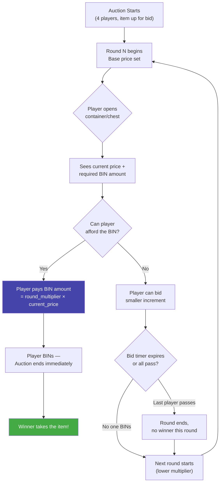

# CLAUDE.md

This file provides guidance to Claude Code (claude.ai/code) when working with code in this repository.

## Project Overview

**MagicAuction** is a PaperMC plugin (1.21+) that implements a container-bidding auction minigame inspired by games where players bid on mystery boxes/items across escalating rounds.

## Build & Development Commands

```bash
# Build all modules (produces shaded plugin JAR in core-plugin/build/libs/)
./gradlew clean build

# Build only the API module (for publishing)
./gradlew :core-api:build

# Build only the plugin shaded JAR (skip API module build)
./gradlew :core-plugin:shadowJar

# Publish API to Yuemi Maven
./gradlew :core-api:publish

# Generate Javadocs
./gradlew :core-api:javadoc

# Test compilation (no full build)
./gradlew clean compileJava compileTestJava
```

The output JAR is at `core-plugin/build/libs/MagicAuction-<version>.jar` — deployable directly to a PaperMC server's `plugins/` directory.

## Game Design — Auction Rounds

The core mechanic is a **container bidding game** with these rules:



**Default round multipliers (configurable):**

| Round | Overbid Multiplier | Vibe |
|-------|-------------------|------|
| 1     | 2.0× | "You *really* want it?" |
| 2     | 1.5× | Getting warmer |
| 3     | 1.3× | Tempting... |
| 4     | 1.1× | Sneaky territory |
| 5     | 1.0× | At cost — BIN or lose it |

- **Players:** 4 per auction session (each opens their own container/chest to bid)
- **Rounds:** 5 rounds per game (configurable count + custom multipliers per round)
- **BIN mechanic:** Each round has an overbid multiplier — to win instantly ("BIN"), a player must outbid the current price by at least that multiplier. The first player to BIN wins the auction — no going once, twice, gone.
- **Winner:** The player who successfully BINs on a round takes the auction item
- The rising tension: early rounds require a huge overbid, late rounds let players snipe at near-market price. If nobody BINs through all 5 rounds, the auction ends with no winner.

All round counts and multipliers should be configurable via `config.yml` so server admins can customize the pacing.

## Architecture

### Module Layout (multi-module Gradle)

```
MC-Magic-Auction/
├── core-api/            # Public API — interfaces + constants, shaded into plugin
│   └── src/main/java/org/yuemi/magicauction/api/
│       ├── MagicAuctionApi.java           # Plugin service interface
│       └── MagicAuctionApiProvider.java    # Service-registry entry point
├── core-plugin/         # Implementation JAR — shaded, server-deployable
│   └── src/main/java/org/yuemi/magicauction/plugin/
│       ├── MagicAuctionPlugin.java         # JavaPlugin entry point (onEnable/onDisable)
│       ├── MagicAuctionApiImpl.java        # API implementation
│       ├── bstats/BStatsService.java       # bStats metrics init
│       └── config/migrations/MigrationV1ToV2.java  # Config migration example
└── build.gradle.kts     # Root — sets Java 21, Paper repo, Yuemi repos
```

- **core-api** (`org.yuemi.magicauction.api`) — `compileOnly` Paper API. Published to Yuemi Maven for other plugins to depend on.
- **core-plugin** (`org.yuemi.magicauction.plugin`) — Shadow-shades `core-api` + bStats + mc-config-libs into a single JAR. This is what goes on the server.

### Plugin Lifecycle

- **onEnable:** Initializes config via `ConfigManager` (with migration path), starts bStats, creates `MagicAuctionApiImpl`, registers it as a Bukkit service (normal priority).
- **onDisable:** Unregisters the API service.

### Config Migration System

Uses `mc-config-libs` — each migration step implements `MigrationStep` (from `org.yuemi.config.api`). Migrations live in `org.yuemi.magicauction.plugin.config.migrations` and the `ConfigManager` auto-discovers them by package scan.

## Key Conventions

- **Package:** `org.yuemi.magicauction.(api|plugin).*`
- **API in `core-api`** (package `api`), implementation in `core-plugin` (package `plugin`)
- **Service registration:** API registered via Bukkit ServicesManager (not a static getter) — consumers look it up with `bukkit.getServicesManager().load(MagicAuctionApi.class)`
- **Messages:** Uses Adventure MiniMessage (`MiniMessage.miniMessage().deserialize(...)`) — not legacy text formatting
- **Feature gating:** Permission-based (`magicauction.feature`)
- **Shadow/relocation:** bStats → `org.yuemi.libs.bstats`, mc-config → `org.yuemi.libs.config`
- **Java 21, Gradle 8.13, Kotlin DSL**

## CI/CD

- **Build workflow** (`.github/workflows/build.yml`): On push to `main` / PR — `./gradlew clean build`, uploads JAR as artifact.
- **Publish workflow** (`.github/workflows/publish.yml`): On `v*` branch push — compiles, auto-updates contributors & version in `gradle.properties`, publishes API to Yuemi Maven, builds plugin JAR, generates Javadocs, deploys to GitHub Pages, publishes to Modrinth, and creates a GitHub Release with changelog.
