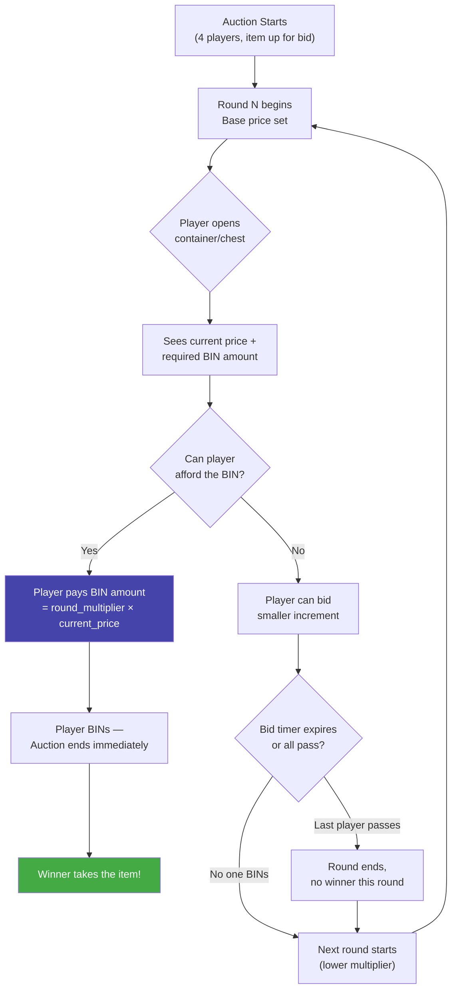

# MagicAuction

A PaperMC plugin (1.21+) that implements an exciting container-bidding auction minigame, inspired by mystery box auctions with escalating rounds.

## Statistics
<a href="https://modrinth.com/plugin/magicauction" target="_blank" rel="noopener noreferrer"></a>


---

## Game Design & Auction Rounds

The core mechanic is a **container bidding game** with escalating tension:



### Game Rules
- **Players:** 4 per auction session (each opens their own container/chest to bid).
- **Rounds:** 5 rounds per game (configurable count + custom multipliers per round).
- **BIN Mechanic:** Each round has an overbid multiplier. To win instantly ("Buy It Now" / BIN), a player must outbid the current price by at least that multiplier. The first player to BIN wins the auction immediately.
- **Winner:** The player who successfully BINs on a round takes the auction item. If nobody BINs through all 5 rounds, the auction ends with no winner.
- **Tension:** Early rounds require a huge overbid (e.g., 2.0x), while later rounds let players snipe at near-market price (e.g., 1.0x).

All round counts and multipliers are configurable via `config.yml`.

### Default Round Multipliers
| Round | Overbid Multiplier | Vibe |
|-------|-------------------|------|
| 1     | 2.0× | "You *really* want it?" |
| 2     | 1.5× | Getting warmer |
| 3     | 1.3× | Tempting... |
| 4     | 1.1× | Sneaky territory |
| 5     | 1.0× | At cost — BIN or lose it |

---

## Build & Development

This project uses Java 21 and Gradle 8.13 with Kotlin DSL.

```bash
# Build all modules (produces shaded plugin JAR in core-plugin/build/libs/)
./gradlew clean build

# Build only the API module (for publishing)
./gradlew :core-api:build

# Build only the plugin shaded JAR (skips API module build)
./gradlew :core-plugin:shadowJar

# Generate Javadocs
./gradlew :core-api:javadoc
```

The output JAR will be located at `core-plugin/build/libs/MagicAuction-<version>.jar` and can be deployed directly to your PaperMC server's `plugins/` directory.

---

## Architecture & Layout

This project uses a multi-module structure to separate the API interface from the implementation:

- **[core-api](file:///f:/Github-Repository/MC-Magic-Auction/core-api)**: Provides public interfaces and constants. Other plugins can depend on this API without pulling in implementation logic.
- **[core-plugin](file:///f:/Github-Repository/MC-Magic-Auction/core-plugin)**: Contains the main plugin implementation, listeners, and shaded dependencies (including `core-api`, `mc-config-libs`, and `bStats`).

### Key Dependencies
- **Paper API (1.21+)** - Server Platform API
- **YueMiLibs** - Runtime library dependency
- **mc-config-libs** - Configuration file management & migration framework
- **bStats** - Metrics collection